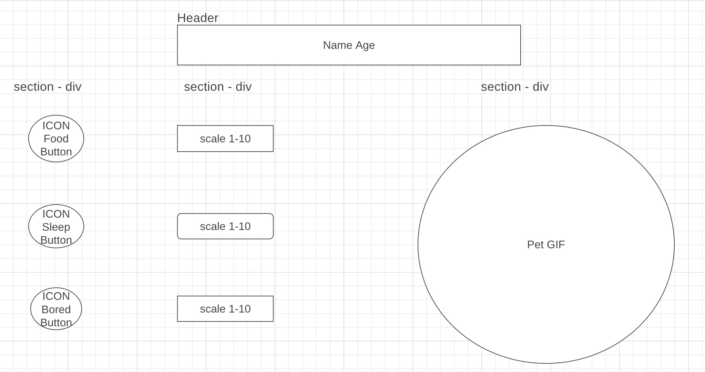

# project-zero
# MVP User Stories 

- As a user, I want to start my game by naming my pet, so that i get an emotional conection. 
- As a user, I want that my Goal is that my Pet survives, so that it can grow old. 
- As a user, I want to feed my Pet when it's hungry (1-10 scale).
- As a user, I want to play with my pet when it's bored so it's scale get's up.
- As a user, I want my Pet to Age, so i see him grow up.
- The Pet will die when the Hunger, Sleepiness, and Bored is below 1.
- As a user, I want to see my Pet be active on the screen when it's happy - Dancing (scale 4-10)
- As a user, I want to see my Pet be sad when it's hungry, sleepy or bored (scale1-3)
- As a user I want my pet to age between a kid, teenager and Adult and change with each step. 

# Wireframe

# Features 

- As a user, I want to choose between 3 Pets: 1,2,3.

- As a user, I want that i can choose between 3 Food variaton and when the scale is at 10 it declines food. 
- As a user, I want to style my Angry Bird, so that it get's a personal touch 
- As a user, I want to have a description of the game so i can understand teh game better. 

