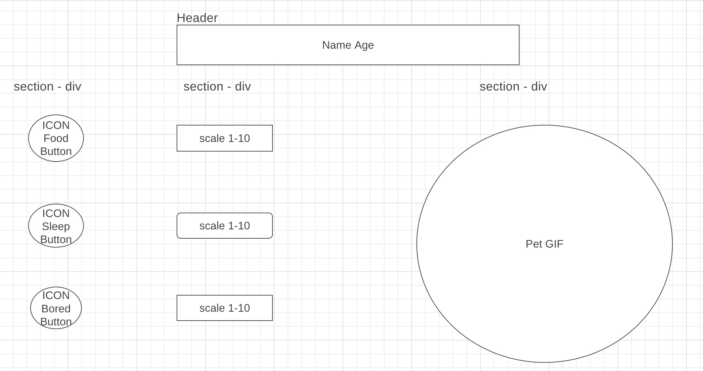

# project-zero

# Angry Bird Game 

Angry Bird is based on the Tamagoshi System. You have to feed, let it sleep or play with it so it doesn't die. It will die when the Hunger, Sleepinees or Boredom hits 10. That means you will have to interact with it so it doesn't die!

That's the first Project "Project-Zero" for the Software Engineer Immersice Course at Generel Assembley. 

 
# Link to Angry Bird Game 

https://sarahdaehn.github.io/project-zero/

# MVP User Stories 

- As a user, I want to have the ability to name my pet, so that i get an emotional conection. 
- As a user, I want that my Goal is that my Pet survives, so that it can grow old. 
- As a user, I want to have a button to feed my Pet when it's hungry (1-10 scale).
- As a user, I want to have a button to play with my pet when it's bored.
- As a user, I want to have a button to put him to sleep when he is tired. 
- As a user, I want my Pet to Age, so i see him grow up.
- The Pet will die when the Hunger, Sleepiness, and Bored hits 10. 
- As a user, I want to have a metrics - Hunger (1-10 scale), Sleepiness (1-10), Boredom (1-10)
- As a user, I want that the Hunger, Boredom and Sleepiness increase on an interval, so that it's more challenging. 
- As a user, I want to see my Pet be active on the screen. 
- As a user I want to see changes when it reach a specific age. 

# Wireframe

# Features 

- As a user, I want to choose between 3 Pets: 1,2,3.
- As a user, I want that i can choose between 3 Food variaton and when the scale is at 10 it declines food. 
- As a user, I want to style my Angry Bird, so that it get's a personal touch 
- As a user, I want to have a description of the game so i can understand the game better. 

# Feature JS 

1. not able to press the button after Angry Bird is dead.
2. when pet dies the other bars stop and the game starts over. / lifeStatus
3. create Levels increase timer each Level 
4. add value to Progress bar 
5. When Angry Birds dies pop up Gif and games ends 
6. restart the game automatically without to refresh the browser 
7. Pop up notification when Hunger, Sleepiness or Boredom is close to 10 and your AngryBird is close to die. 
8. Add sounds to the buttons
9. Add Age also to a Progress Bar

# Feature HTML 

1. restructure the index File 

# Feature CSS

1. header 
2. GIF Quality - stop the zoom in when the Browser grows - object-fit : fill / cover;
3. Change Background first loading 
4. change colors from the buttons and bar 
5. Browser ajustments 

# Technologies 

1. HTML
2. CSS
3. Java Script

